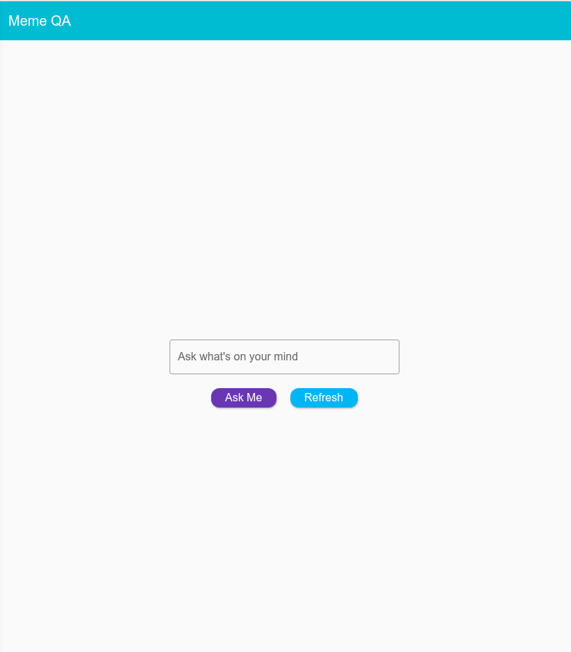
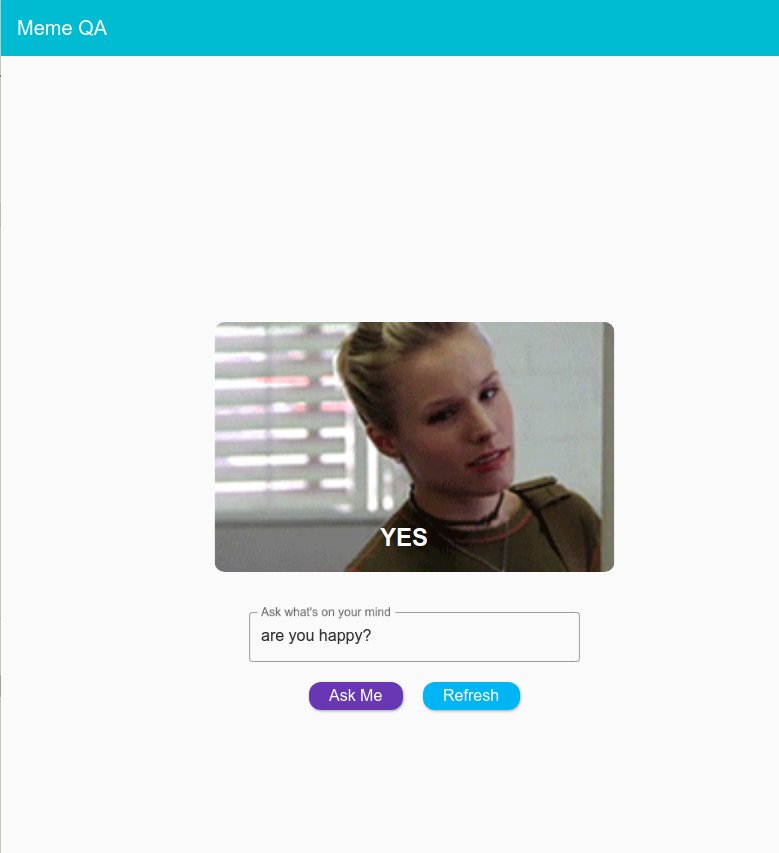
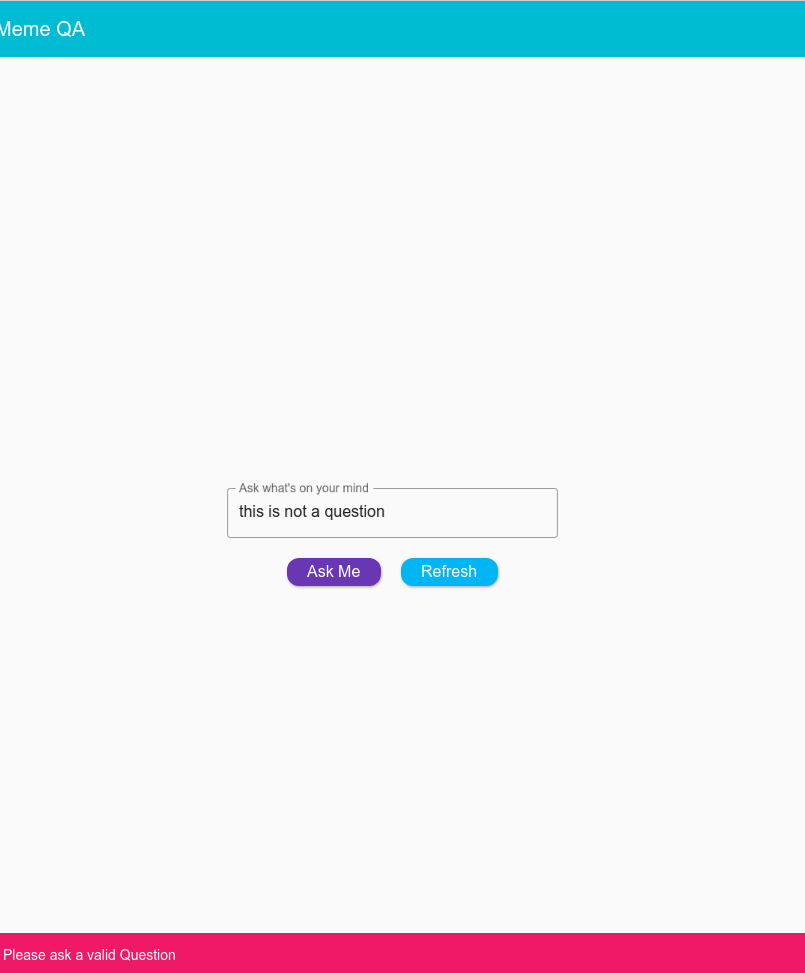

# Meme QA

## A simple flutter app that takes a question and shows random yes/no answer with a relevant gif image.

<hr>

## Demo

<table>
  <tr>
    <td>Hompage</td>
  </tr>
  <tr>
    <td></td>
  </tr>

   <tr>
    <td>Meme answer</td>
  </tr>
  <tr>
    <td></td>
  </tr>

  <tr>
    <td>Invalid question</td>
  </tr>
  <tr>
    <td></td>
  </tr>
   
 </table>
<br/><hr><br/>

## Stacks

<br/>

- Dart
- Flutter

<br/><hr><br/>

## Features

```
1. takes a question and show yes/no answer randomly
2. shows relavant meme gif
3. simple validation added to validate a question
4. If not a valid question, user will be notified with a snackbar
5. Reresh button to refresh the UI
```

<br/><hr><br/>

## Live Demo

<br/>

[](https://memeqa.netlify.app/)
